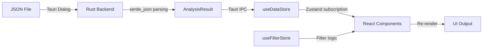

# Agent.md

This file provides guidance to AI coding agents when working with code in this repository.

## Project Overview

The **LLM Hermeneutic Workbench** is a desktop application for semantic triple analysis and visualization. Built as a Tauri 2 app with a React 19 frontend, it provides a human-in-the-loop interface for exploring, filtering, and validating LLM-generated semantic extractions from text sources (primarily interview transcripts).

## Technology Stack

| Layer | Technology | Version |
|-------|------------|---------|
| **Desktop Runtime** | Tauri | 2.x |
| **Backend** | Rust | 2021 Edition |
| **Frontend Framework** | React | 19.1.0 |
| **Build Tool** | Vite | 7.x |
| **Language** | TypeScript | 5.8.x |
| **State Management** | Zustand | 5.x |
| **Graph Visualization** | vis-network | 10.x |
| **Styling** | CSS (vanilla, no frameworks) | — |

## Core Architecture

### Project Structure
```
LLM Hermeneutic Workbench/
├── hermeneutic-workbench/              # Main Tauri application
│   ├── src/                            # React frontend source
│   │   ├── App.tsx                     # Main application component
│   │   ├── main.tsx                    # React entry point
│   │   ├── components/                 # React UI components
│   │   │   ├── AppBar/                 # Top navigation bar
│   │   │   ├── Sidebar/                # Entity filters and analytics panel
│   │   │   ├── GlobalSummary/          # Statistics dashboard cards
│   │   │   ├── ExtractionCard/         # Semantic triple display cards
│   │   │   ├── NetworkModal/           # Graph visualization modal
│   │   │   └── AnimatedNumber/         # Counting animation component
│   │   ├── stores/                     # Zustand state management
│   │   │   ├── useDataStore.ts         # Data loading and computed analytics
│   │   │   ├── useFilterStore.ts       # Filter state management
│   │   │   └── useUIStore.ts           # UI state (modals, sidebars, sections)
│   │   ├── types/                      # TypeScript type definitions
│   │   │   └── data.ts                 # Semantic triple interfaces
│   │   └── styles/                     # CSS stylesheets
│   │       ├── design-tokens.css       # CSS variables, colors, typography
│   │       ├── components.css          # Component-specific styles
│   │       ├── network-modal.css       # Graph visualization styles
│   │       └── app.css                 # Layout and global styles
│   ├── src-tauri/                      # Rust backend source
│   │   ├── src/
│   │   │   ├── lib.rs                  # Tauri plugin registration
│   │   │   ├── main.rs                 # Application entry point
│   │   │   ├── commands/mod.rs         # Tauri IPC commands
│   │   │   └── models/                 # Rust data structures
│   │   ├── Cargo.toml                  # Rust dependencies
│   │   └── tauri.conf.json             # Tauri configuration
│   ├── package.json                    # Node.js dependencies and scripts
│   └── vite.config.ts                  # Vite build configuration
├── generate_report_modern.py           # Legacy: Static HTML report generator
├── template_modern.html.j2             # Legacy: Jinja2 HTML template
└── *.json                              # Input data files
```

### Data Flow Architecture



1. **File Selection**: User selects JSON via native file dialog (`tauri-plugin-dialog`)
2. **Backend Processing**: Rust backend parses JSON using `serde_json` and computes analytics
3. **State Hydration**: Frontend receives processed data via Tauri IPC (`invoke`)
4. **Reactive Rendering**: Zustand stores trigger React re-renders on state changes
5. **Filtering**: `useFilterStore` manages filter state; `App.tsx` computes filtered views via `useMemo`

## Development Commands

### Run Development Server
```bash
cd hermeneutic-workbench
npm run dev          # Start Vite dev server only
npm run tauri dev    # Start full Tauri development mode
```

### Build Production
```bash
cd hermeneutic-workbench
npm run build            # Build frontend only
npm run tauri build      # Build full desktop application
```

### Dependencies
```bash
# Install frontend dependencies
cd hermeneutic-workbench
npm install

# Rust dependencies are managed via Cargo.toml (automatic)
```

### Required Tooling
- **Node.js** ≥ 18.x
- **Rust** (stable toolchain)
- **Tauri CLI**: `npm run tauri` or globally via `cargo install tauri-cli`

## Data Structure Specification

### Input JSON Schema
```typescript
// Root: Array<SpeakerTurn>
interface SpeakerTurn {
  speaker_name: string;
  role: string;
  utterance_order: number;
  extractions: Extraction[];
  extraction_count?: number;
  source?: string;
  metadata_source_file?: string;
  metadata_interview_id?: string;
}

interface Extraction {
  subject_entity: Entity;
  relation: Relation;
  object_entity: Entity;
  evidence_text: string;
  evidence_sources?: string[];
}

interface Entity {
  name: string;
  entity_type: string;
}

interface Relation {
  surface_form: string;
  semantic_form: string;
}
```

### Computed Analytics (from Rust backend)
| Field | Type | Description |
|-------|------|-------------|
| `global_stats` | `GlobalStats` | Aggregated metrics (total extractions, unique entities, etc.) |
| `entity_types` | `EntityTypeInfo[]` | Entity types sorted by frequency |
| `entity_types_high_freq` | `EntityTypeInfo[]` | High frequency tier (≥5 utterances) |
| `entity_types_medium_freq` | `EntityTypeInfo[]` | Medium frequency tier (2-4 utterances) |
| `entity_types_low_freq` | `EntityTypeInfo[]` | Low frequency tier (1 utterance) |
| `structural_patterns` | `StructuralPattern[]` | Subject→Relation→Object pattern counts |
| `relation_frequency_map` | `Record<string, number>` | Relation occurrence counts |
| `multi_typed_entities` | `Record<string, string[]>` | Entities appearing as multiple types |
| `top_diverse_relations` | `RelationDiversity[]` | Relations with highest domain/range diversity |

## State Management

### Zustand Stores

| Store | Purpose | Key State |
|-------|---------|-----------|
| `useDataStore` | Data loading & analytics | `speakerTurns`, `entityTypes`, `globalStats`, `isLoading`, `error` |
| `useFilterStore` | Filter coordination | `activeTypeFilters`, `activePatternFilter`, `searchTerm` |
| `useUIStore` | UI state management | `isNetworkModalOpen`, `collapsedSections`, `patternsDisplayCount` |

### Filter Logic
Filtering is reactive and computed in `App.tsx` using `useMemo`:
- **Type Filter**: Matches if subject OR object entity type is in `activeTypeFilters`
- **Pattern Filter**: Matches exact `subject_type → relation → object_type` pattern
- **Relation Filter**: Matches `semantic_form` of relation
- **Search Filter**: Case-insensitive substring match across evidence text, entity names, relation forms

## React Components

| Component | Purpose | Key Props/Features |
|-----------|---------|-------------------|
| `AppBar` | Top navigation | Search bar, Open JSON button, Visualise button, theme toggle |
| `GlobalSummary` | Statistics dashboard | 5 animated stat cards, responds to filter changes |
| `ExtractionCard` | Triple display | Entity badges, relation display, evidence text |
| `Sidebar` | Filter panel | Entity type badges (3 tiers), pattern analytics, export buttons |
| `NetworkModal` | Graph visualization | vis-network integration, physics controls, hop distance, clustering |
| `AnimatedNumber` | Counting animation | Smooth value transitions for statistics |

## Rust Backend

### Tauri Commands

| Command | Description | Return Type |
|---------|-------------|-------------|
| `load_json_file` | Load and analyze JSON file | `AnalysisResult` |
| `load_raw_json` | Load JSON without analysis (debugging) | `Vec<SpeakerTurn>` |

### Tauri Plugins
- `tauri-plugin-fs`: File system access
- `tauri-plugin-dialog`: Native file dialogs
- `tauri-plugin-shell`: Shell command execution
- `tauri-plugin-opener`: URL/file opening

### Rust Dependencies
```toml
tauri = "2"
serde = { version = "1", features = ["derive"] }
serde_json = "1"
rusqlite = { version = "0.31", features = ["bundled"] }
thiserror = "1"
```

## Design System

### CSS Variables (`design-tokens.css`)
| Category | Example Variables |
|----------|-------------------|
| **Colors** | `--color-primary: #3A87FD`, `--color-secondary: #E07C3A` |
| **Typography** | `--font-body: Inter`, `--font-ui: PT Sans Narrow` |
| **Spacing** | `--spacing-sm: 8px`, `--border-radius: 12px` |
| **Entity Badges** | High freq (blue), Medium (orange), Low (green/teal) |

### Component Styling
- **Cards**: Subtle shadows with 12px border radius
- **Badges**: Color-coded by frequency tier, clickable for filtering
- **Layout**: Two-column responsive grid (main content + sidebar)

## Interactive Features

### Dashboard
- **Real-time filtering**: Entity types, relations, structural patterns
- **Dynamic statistics**: Animated number transitions when filters change
- **Text search**: Full-text search across all extraction data
- **Collapsible sections**: Expandable analytics panels

### Network Visualization
- **vis-network integration**: Force-directed graph layout
- **Controls**: Physics toggle, node/edge labels, hop distance (0-2), clustering
- **Export**: PNG image, JSON data, CSV edges
- **Keyboard shortcuts**: P (physics), L (labels), F (fit), C (cluster)

## Legacy Components

The following files are from the original static HTML report generator and are retained for backwards compatibility:

| File | Purpose |
|------|---------|
| `generate_report_modern.py` | Python script for static HTML report generation |
| `template_modern.html.j2` | Jinja2 template for static HTML output |
| `templates/partials/` | HTML partial templates |
| `static/` | Legacy CSS/JS for static reports |
| `semantic_triple_analysis.py` | Advanced analytics with pandas/networkx |

## Troubleshooting

### Common Issues

1. **App won't start**: Ensure Rust toolchain is installed (`rustup show`)
2. **JSON not loading**: Verify JSON structure matches `SpeakerTurn[]` schema
3. **Network visualization blank**: Check browser console for vis-network errors
4. **Filters not working**: Verify entity types exist in loaded data (case-sensitive matching)
5. **Build fails**: Run `npm install` and ensure Tauri CLI is available

### Debug Tips
- Frontend logs prefixed with `[DataStore]`, `[FilterStore]`, `[App]`
- Rust errors returned via Tauri IPC as `CommandError` strings
- Use `load_raw_json` command for raw data debugging

## Recent Updates (2026-01)

### Desktop Application Migration
- Migrated from static HTML generator to full Tauri desktop application
- Implemented React 19 frontend with TypeScript
- Added Zustand state management for reactive data flow
- Created Rust backend for JSON parsing and analytics computation
- Integrated vis-network for interactive graph visualization