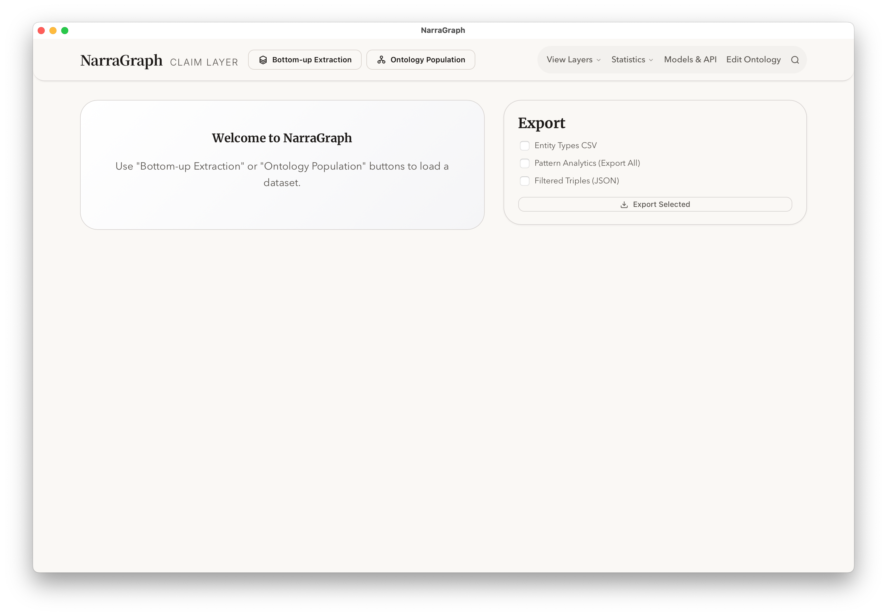
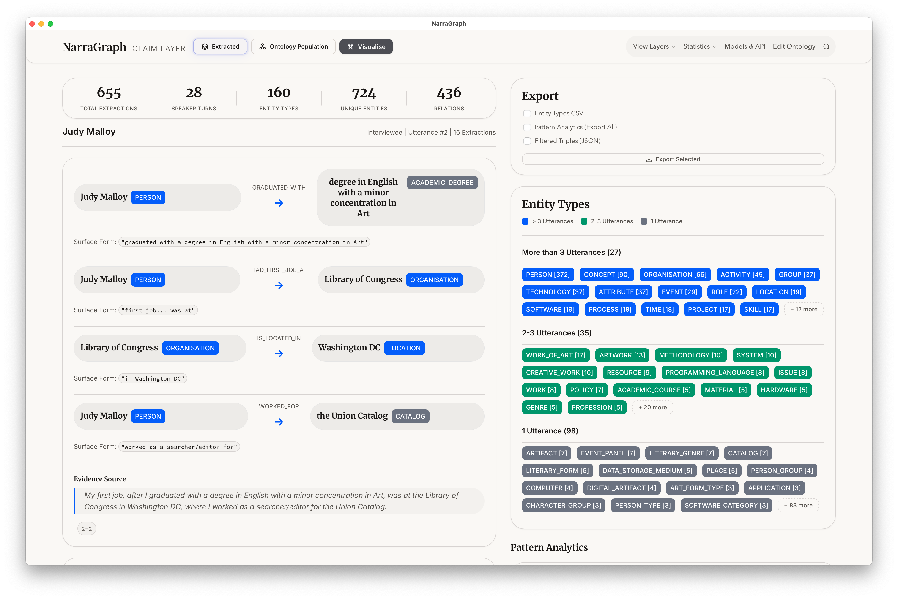
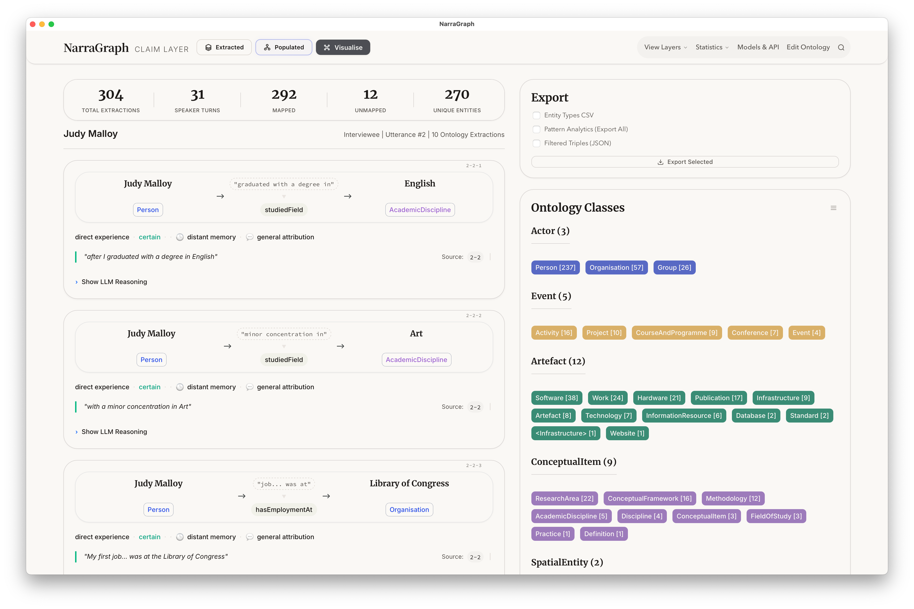

# Example Usage Guide

This guide demonstrates how to load example data into the NarraGraph Workbench to explore its features.

### 1. Main Interface
Upon launching the application, you will be presented with the main interface as shown below.

### 2. Bottom-up Extraction
To explore bottom-up extraction results:
1. Click on the **Bottom-Up Extraction** button.
2. Import the file named `Test_ButtomUp_Extraction.json` from this directory.
3. The interface will populate with the extraction results, as illustrated in the figure below.

### 3. Ontology Population
To view ontology population results:
1. Click on the **Ontology Population** button.
2. Import the file named `Test_OntologyPopulation.json` from this directory.
3. The interface will display the ontology population mapping, as shown below.

