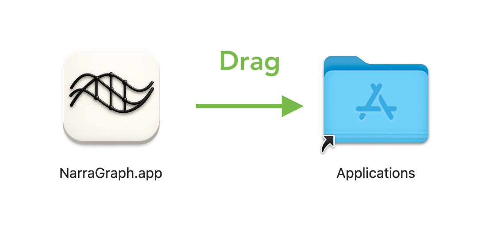
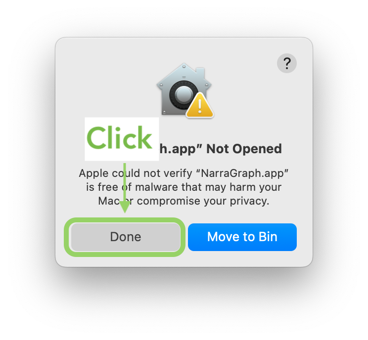
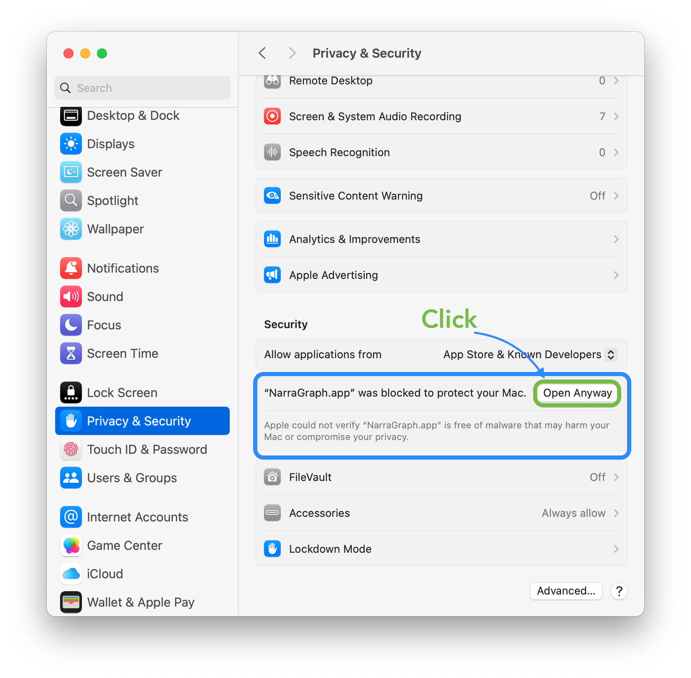
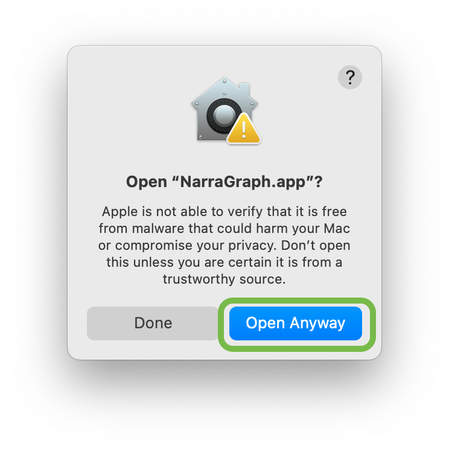
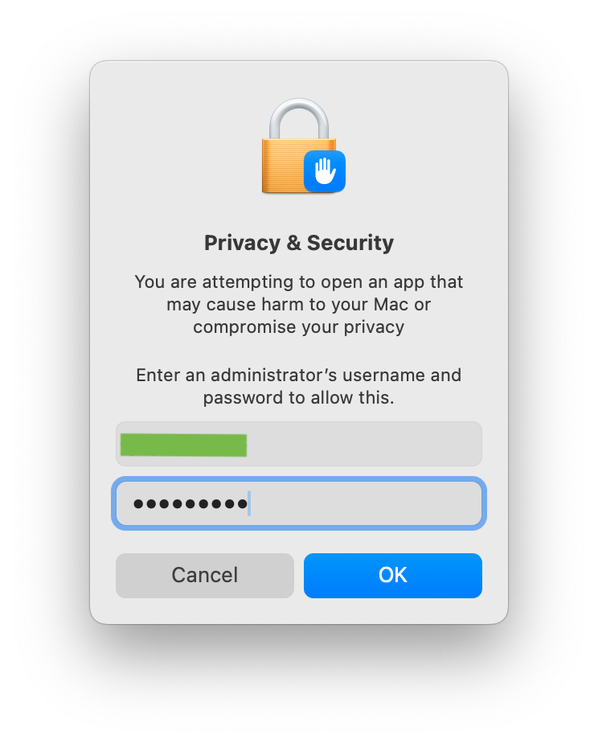

# How to Open the Workbench

This guide provides step-by-step instructions for installing and opening the NarraGraph Workbench on macOS using the downloaded installation package.

### Step 1: Install the Application
Drag the application icon into the **Applications** folder, as shown in **Figure 0**.

### Step 2: Initial Launch Attempt
After installation, attempt to open the application. You may see a security warning stating: *"Apple could not verify “NarraGraph.app” is free of malware..."* (see **Figure 1**). Click **Done** to dismiss this message.

### Step 3: Adjust Privacy & Security Settings
Navigate to **System Settings** > **Privacy & Security**. Scroll down to the security section where you will see a message about "NarraGraph.app". Click **Open Anyway**, as highlighted in **Figure 2**.

### Step 4: Confirm Opening
A prompt will appear asking you to confirm that you wish to open the application. Click **Open Anyway** again (see **Figure 3**).

### Step 5: Authenticate
Finally, enter your system login password when prompted, as shown in **Figure 4**. The application will now launch.

