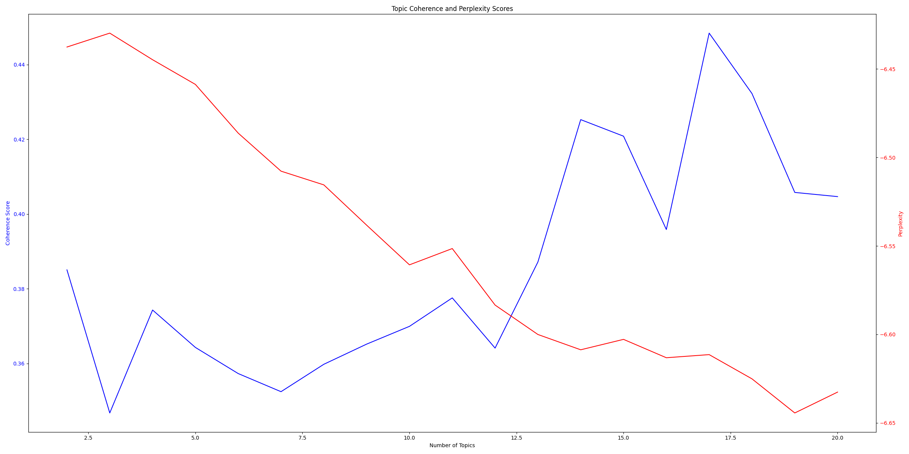

## Some thought about using the interview structure:
While I'm exploring the interview text, I was very curious about whether we can take account into the turn-taking nature of the dialogues in the interviews when analysing  the text. 

<mark style="background: #FFB86CA6;">Julianne's comment: That is an excellent idea and very important in the context of oral history. There are various things we could think about, that are frameworks in sociology that we could draw on for analysing things like turn taking, interruptions, length of time talking.</mark>

> Jiajie's answer: Thank you so much for your encouragement! I think this is an exciting part for us to have a careful look at using the text mining. As I don't have a sufficient background of sociology, this would take some time for us to research and experiment, perhaps I need to discuss with Andreas and Marco, firstly to make sure I can deliver what the Andreas expected on time. Then move on the planning and research on this topic.


In our current text analysis of oral history interviews, we're processing the transcripts as continuous text. However, given the dialogic nature of interviews, could we enhance our analysis strategically by separately processing questions and answers? How might this approach improve our keyword extraction, topic modelling, and overall understanding of the interview dynamics?

<mark style="background: #FFB86CA6;"> Julianne's comment: yes so segmentation of the interviews into questions and answers will be crucial</mark>

> Jiajie's answer: Yes, for this task I will need to either manually segment the questions and answers or develop a method to automatically segment them. With a method to validate the integrity of all the segmentations, this is to make sure no information is missing after segmentation. Also come up with a robust plan for these experiments. Some initial ideas like:
- apply separate keyword extraction and topic modelling to questions and answers. This could potentially reveal differences in response between interviewees; and the shift of topic within the conversation.


As this it the initial explorative text analysis, we tend to use the unsupervised methods:

<mark style="background: #FFB86CA6;">Julianne's comment: Great, can I briefly discuss with you why that is, is it because supervised methods will presume that we have an annotated corpus to work with?</mark>

> Jiajie's answer: Yes, you are right about the need of annotated corpus to use supervised methods. The supervised method often requires large amount of annotated data to run. For example the customised named entity recognition or document classification. Depending on different models, the size of annotated data required from the similar domain to train a customised NER models are different, for example the deep learning based models requires large amount of annotation (approximately 2k to 5k); for some generative AI based methods, which has better performance on few-shot learning, only need very few annotated data or examples (approximately 3 - 5).
> While in this early stage of text mining, using the unsupervised methods is to gain an overall understanding of the corpus, it is more of a "let the data speak for itself" without introducing any prior knowledge.
> We also have a goal of extracting the terms to enrich the list of controlled vocabulary, which could be used to describe the field "Keywords" and "Topic" in File Schema, therefore these unsupervised keyword extraction and topic modelling methods are used in this stage.

## Keyword Level
1. **TF-IDF**:
   A few changes are made based on Marco’s implementation:
   * Used a larger base model in spaCy
   * Add customised stopwords to exclude the names and their abbreviations of interviewer and interviewee
   * Change max_df from 0.5 to 0.8 (Ignores terms appearing in more than 80% of the documents, filtering out very common terms.)
2. **RAKE** (Rapid Automatic Keyword Extraction) to extract keywords
   * RAKE rely on his hypothesis that stopwords are often the borders of the keywords, by using the stopwords it can generate a list of candidate
   * The choice of stopword should be particularly careful
   * works well on small single document
   * Cannot capture the how unusual/unique the keyword is among the set of documents as TF-IDF
3. **YAKE** (Yet Another Keyword Extractor)
   * scores keywords based on term frequency, term position, term relatedness to context
   * 
4. TextRank
	- TODO

<mark style="background: #FFB86CA6;">Julianne's comment: 1. Excellent - there was also some issues with ngrams that need to be kept together and not treated as single words, mostly entities e.g. Atlas Computer Lab , Can we talk about this?</mark>

> Jiajie's answer: Yes, as we discussed in the last meeting it is much better to have an accurate form of extracted entities, there are several solutions could be used to help us generate a more accurate keyword: 1. Use Frieda's coding and apply the rule-based method, change "Atlas Computer Lab" to "Atlas_Computer_Lab". 2. Create custom NER model, using Frieda's coding as training data.


<mark style="background: #FFB86CA6;">Julianne's comment: 2.Is there also an approach that could help us to detect highly unusual co-occurring words in the context of an interview or interview corpus?</mark>

>  Jiajie's answer: This is a very good question. This might be related to the 'The Long Tail' issue in statistic and many other data related area, which refers to the rarely seen data points but with great value. I will certainly need further research on this. 
>  some initial ideas: 1. Using Mutual Information (MI) and Pointwise Mutual Information (PMI) to calculate the degree of association between word pairs. 2. Create a word co-occurrence network where nodes are words and edges represent co-occurrence strength

## Topic level
### Latent Dirichlet Allocation （LDA）
* Need to Define the number of topics (K), therefore I use coherence and perplexity values to automatically find out the optimal number of topics.
```
Coherence: This metric measures the semantic similarity between the top words in a topic. Higher coherence values generally indicate more interpretable and meaningful topics. Coherence is often considered a better indicator of topic quality than perplexity, especially when the goal is to produce human-interpretable topics.

Perplexity: This is a measure of how well a probabilistic model predicts a sample. For LDA, it reflects how well the model predicts the distribution of words in unseen documents. Lower perplexity generally indicates a better model fit, but it doesn’t always correlate with human interpretability of the topics.
```




* Technical detail of LDA

```
* Randomly assign each word in each document to one of the K topics.
* For each document:
    - Calculate the proportion of words assigned to each topic
    - 
* For each word:
	- Calculate the proportion of words in the current topic that are the current word.
	- Reassign the word to a new topic based on these proportions.
```

<mark style="background: #FFB86CA6;">Julianne's comment: This i think i need to ask you about as well</mark>

> Perhaps you can be more specific here?

### BERTopic
How it works:
* It create document embedding using transformer-based model ( in our solution, we use sentenceTransformer "all-mpnet-base-v2")
* Reduce dimension using UMAP and cluster the embedding using HDBSCAN

But sometimes it is possible to struggle with very short texts or highly specialised domains.


ref:
https://www.pinecone.io/learn/bertopic/


Visualisations: three word cloud figures based on:
   * Marco’s TF-IDF implementation
   * A revised tf-idf implementation (n-gram: 1-2)
   * RAKE keywords (n-gram: 2 & 3)
   * YAKE (n-gram: 1 and 2)
   * LDA (5 topic and 17 topic) (document topic distribution heatmap, hierarchical topic tree)
   * BERTopic


Some interpretation on the hierarchical topic modelling results from LDA:

"german provide center" & "author computational center":
- Possible Broader Topic: Digital Infrastructure for Humanities Research

"TEI nancy center" & "philosophy scholarly encoding":
- Possible Broader Topic: Text Encoding and Scholarly Communication

"lab apple faculty" & "tei antonio discussion":
- Possible Broader Topic: Collaborative Digital Projects and Scholarly Networks

<mark style="background: #FFB86CA6;">Julianne's comment: so this is an example of where I think we need to look at the encoding of entities, this is almost certainly antonio zampolli-</mark>

> Yes, as we discussed in the above question. I will refine the experiments and produce keywords in a more accurate form.


Comparing Keyword VS Topic:

| Aspect                                | TF-IDF                                                                                     | RAKE                                                                                     | YAKE                                                                                                   | LDA                                                                                      | BERTopic                                                                            |
| ------------------------------------- | ------------------------------------------------------------------------------------------ | ---------------------------------------------------------------------------------------- | ------------------------------------------------------------------------------------------------------ | ---------------------------------------------------------------------------------------- | ----------------------------------------------------------------------------------- |
| **Contextual Understanding**          | Limited; treats documents as bag of words                                                  | Limited; considers word co-occurrences within a window                                   | Moderate; considers multiple features within a single document                                         | Moderate; considers word co-occurrences across corpus                                    | Deep; use transformer based language models for semantic understanding              |
| **Information Processed**             | - Word occurrences<br>- Document frequency                                                 | - Word co-occurrence frequency<br>- Word degree                                          | - Term frequency<br>- Term position<br>- Term relatedness to context<br>- Term casing<br>- Term spread | - Word co-occurrences across corpus<br>- Document-level word frequencies                 | - Full text, preserving word order<br>- Semantic relationships from pre-training    |
| **Information Produced**              | - Numerical scores for terms in each document                                              | - Ranked list of keyphrases for each document                                            | - Ranked list of keyphrases for each document                                                          | - Topics as word distributions<br>- Topic proportions for documents                      | - Topics with most relevant terms<br>- Document embeddings and clusters             |
| **Strengths for MeDoraH**             | - Identifies key terms specific to each interview<br>- Useful for document-level summaries | - Extracts meaningful phrases<br>- Good for identifying technical terms in DH interviews | - Considers multiple aspects of term importance<br>- Effective for single-document keyword extraction  | - Discovers themes across multiple interviews<br>- Reveals hidden patterns in the corpus | - Captures nuanced, coherent themes<br>- Handles semantic complexity well           |
| **Limitations for MeDoraH**           | - Misses semantic relationships<br>- Doesn't capture themes across interviews              | - Doesn't consider corpus-wide statistics<br>- May miss broader themes                   | - Limited to single-document analysis<br>- May not capture cross-interview themes                      | - Topics can be incoherent<br>- Requires careful parameter tuning                        | - Computationally intensive<br>- May require large corpus for best results          |
| **Ontology Development Contribution** | - Identifies key concepts for detailed vocabulary                                          | - Helps identify multi-word expressions and technical terms                              | - Provides context-aware key terms for ontology                                                        | - Informs top-level categories and relationships                                         | - Captures nuanced relationships and concepts                                       |
| **Example in MeDoraH Context**        | High score for "punch cards" in early computing interviews                                 | Identifies "digital archive creation" as a key phrase                                    | Extracts "FORTRAN programming" considering its context and distribution                                | Topic on "Early Text Digitization" with terms like OCR, scanning, microfilm              | Topic on "Interdisciplinary Collaboration Challenges" capturing nuanced discussions |
| **Recommended Use in MeDoraH**        | Identify unique terms in individual interviews                                             | Extract technical phrases and domain-specific terminology                                | Complement TF-IDF and RAKE for robust keyword extraction                                               | Discover broad themes across the oral history corpus                                     | Capture subtle, semantically rich topics and evolving concepts in DH history        |


### Sentiment Analysis:
TODO  


## Relevant materials:
### Modelling Interview Contents:
* DAMSL (Dialogue Act Markup in Several Layers) or ISO 24617-2 for annotating dialogue acts, for consistency and interoperability with other research

References:
1. Allen, J.F. (2007). Draft of DAMSL Dialog Act Markup in Several Layers. https://www.semanticscholar.org/paper/Draft-of-DAMSL-Dialog-Act-Markup-in-Several-Layers-Allen/ea4f134991e44df0e868a3ffeb0cb3d74f315f09
2. Leech, G., & Weisser, M. (2003). Generic speech act annotation for task-oriented dialogues. https://www.semanticscholar.org/paper/Generic-speech-act-annotation-for-task-oriented-Leech-Weisser/5869397d550d8440fcd4724083a4b09375703e3b
3. Bunt, Harry et al. “ISO 24617-2: A semantically-based standard for dialogue annotation.” *International Conference on Language Resources and Evaluation* (2012). ** https://www.semanticscholar.org/paper/ISO-24617-2%3A-A-semantically-based-standard-for-Bunt-Alexandersson/5e3ea9e26417e6d2be6374a0b1c3227cee782953
4. 

### **Dialogue Acts Analysis in Interviews**
1. **Question-Answer Sequences:** Classify the types of questions asked by the interviewer (e.g., open-ended, closed, probing) and the corresponding responses.
2. **Narrative Construction:** Identify how interviewees construct their narratives, including statements, elaborations, and clarifications.
3. **Interview Goals:** Analyze how the interviewer uses dialogue acts to achieve specific goals, such as eliciting information, clarifying points, or encouraging elaboration.

**Practical Examples**
1. **Interview Flow and Control:**
   * Shows that the interviewer uses a high number of closed questions, limiting the interviewee’s ability to elaborate on their responses.
2. **Narrative Construction:**
   * Reveals that the interviewee frequently uses elaborations and personal anecdotes to construct their narrative.
3. **Power Dynamics:**
   * Indicates that the interviewee often uses acknowledgments and agreements, suggesting deference to the interviewer’s authority.
