# Workflow diagrams 

This is to help us understand the NLP toolkits avaliable in different stages of ontology constuction:

## A general workflow of ontology constuction:

The steps in the workflow will be broken down one by one in the diagram below.

## Workflow for conceptualising:

## Workflow for ontology population:

